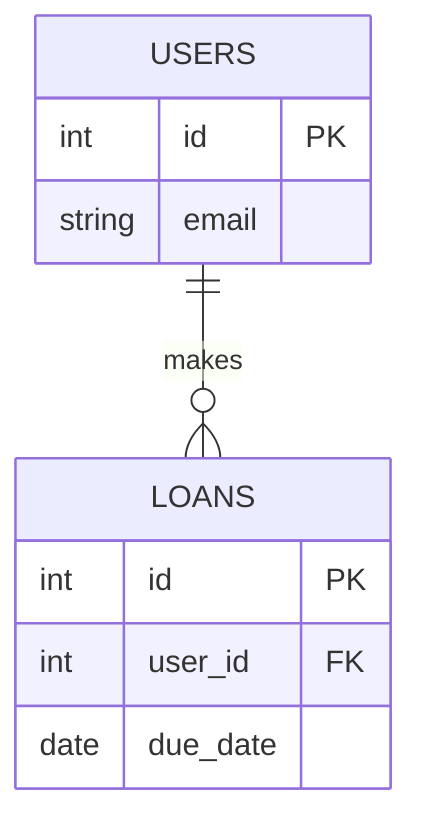

# ERD Generator
Turn a plain-language domain description into a validated Mermaid ERD and a rendered SVG image.

## Workflow

1. **Parse the requirements.** Identify every entity, its attributes and their types, its primary key (`PK`), its foreign keys (`FK`), and the cardinality of each relationship (one-to-one, one-to-many, many-to-many).

2. **Write the Mermaid file.** Write the diagram directly to `docs/architecture/schema.mmd`. It must start with `erDiagram`. Rouhgly follow this format:

   Rules:
   - Entity names are UPPERCASE with underscores (e.g. `BOOK_AUTHORS`).
   - Attribute lines are `type name` followed by `PK` or `FK` when it applies.
   - Use only simple types: `int`, `string`, `text`, `boolean`, `date`, `timestamp`, `decimal`.
   - Relationship labels go in double quotes.
   - Cardinalities: `||--||` one-to-one, `||--o|` one to zero-or-one, `||--o{` one-to-many.

3. **Validate and render.** From the project root, run:

   node .agent/skills/erd-generator/scripts/render_erd.js docs/architecture/schema.mmd

4. **Self-correction loop.** If the output starts with `SYNTAX_ERROR`, parse the error trace, find the line it points to, fix the Mermaid syntax in `docs/architecture/schema.mmd`, and run the script again. Retry at most 3 times. If it still fails after 3 retries, stop and show the user the last error.

5. **Final output.** When the script prints `SUCCESS`:
  1.Show the user the full raw Mermaid code block from `docs/architecture/schema.mmd`.
  2.Tell the user the rendered image is at `docs/architecture/erd.svg`.